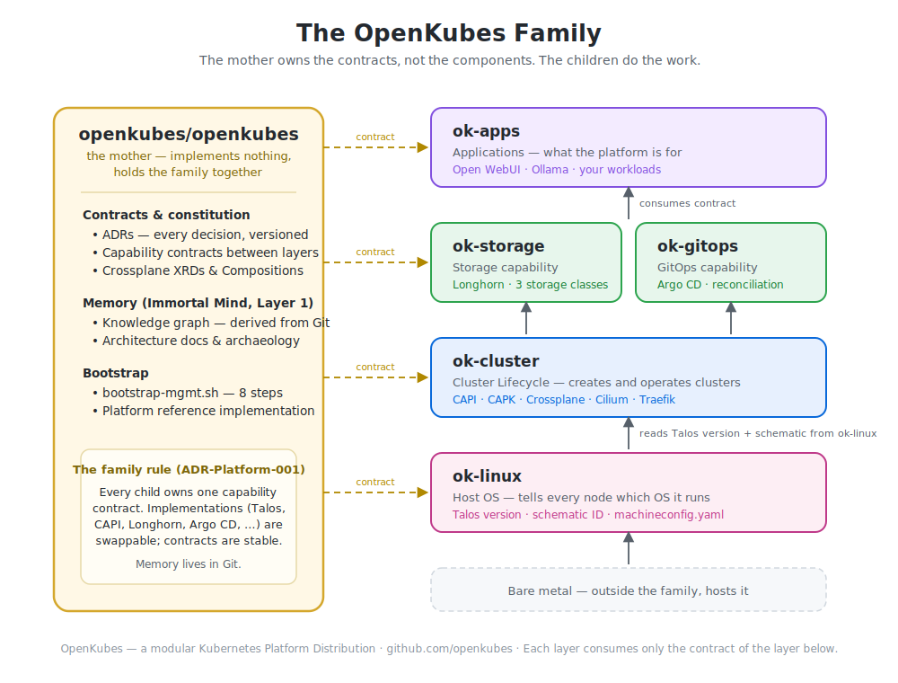

# OpenKubes

<!-- SHIELDS -->


<div align="center">

### Kubernetes is a platform for building platforms.

### OpenKubes builds Kubernetes Platform*S*.

<sub>The capital S is intentional.</sub>

*Bare Metal · Edge · On-Premises · Multi-Cloud*

</div>

---

> **OpenKubes is a framework for building sovereign Kubernetes platform distributions.**
> It defines stable contracts between platform layers — and lets the ecosystem provide the implementations.

> *OpenKubes owns the contracts, not the components.*

---

## Platform Architecture



---

## The OpenKubes Family

> The mother owns the contracts, not the components. The children do the work.

[](./docs/openkubes-family.md)

Each repository owns exactly one capability contract — `ok-linux` (Host OS), `ok-cluster` (Cluster Lifecycle), `ok-storage`, `ok-observability`, `ok-gitops`, `ok-apps` — while this repository holds the contracts, the decisions (ADRs), and the [knowledge graph](https://kubernauts.de/en/openkubes/openkubes_knowledge_graph_force_layout.html) that connects them.
→ Full story: [The OpenKubes Family](./docs/openkubes-family.md)

---

## What OpenKubes ships today

```bash
# Provision a Management Cluster
make new CLUSTER=ok-mgmt TYPE=talos NODE_SELECTOR=ok-infra WORKERS=2
make bootstrap CLUSTER=ok-mgmt
bash bootstrap-mgmt.sh   # Crossplane + CAPI + AI Platform XRDs — ~2 min

# Provision a Workload Cluster
make new CLUSTER=ok1-talos TYPE=talos WORKERS=1
make bootstrap CLUSTER=ok1-talos
make install-storage CLUSTER=ok1-talos
make register-cluster CLUSTER=ok1-talos   # wire it into the management plane (ADR-013)

# Deploy Private AI on the workload cluster — from the management cluster
make deploy CLUSTER=ok1-talos   # → Open WebUI + Ollama in ~90 seconds
```

That last command submits a `OpenWebUIClaim` to Crossplane on `ok-mgmt`.
The platform handles the rest. No Helm expertise needed. No manual configuration.

---

## Platform Components

| Repository | Contract | Status |
|---|---|---|
| [`openkubes/openkubes`](https://github.com/openkubes/openkubes) | Platform Distribution, ADRs, XRDs, AI Platform | ✅ v0.3.0 |
| [`openkubes/ok-cluster`](https://github.com/openkubes/ok-cluster) | Cluster Lifecycle Contract | ✅ v0.10.0 |
| [`openkubes/ok-linux`](https://github.com/openkubes/ok-linux) | OS Capability Contract (Talos) | ✅ v0.1.1 |
| [`openkubes/ok-storage`](https://github.com/openkubes/ok-storage) | Persistent Storage Contract | ✅ v0.1.0 |
| [`openkubes/ok-observability`](https://github.com/openkubes/ok-observability) | Observability Capability Contract | 🚧 scaffold (ADR-Platform-018) |
| `openkubes/ok-gitops` | GitOps Contract | 📋 planned |
| `openkubes/ok-apps` | Application Contract | 📋 planned |

---

## OpenKubes AI — Private GPT, On-Prem, Sovereign

Every workload cluster can receive its own private AI workspace through the same declarative platform that provisions Kubernetes itself.

```yaml
apiVersion: platform.openkubes.ai/v1alpha1
kind: OpenWebUIClaim
metadata:
  name: my-team
  namespace: openkubes-system
spec:
  clusterRef: ok1-talos
  ollamaEndpoint: http://<ollama-ip>:11434
  namespace: open-webui
```

```bash
kubectl apply -f claim.yaml
# → Open WebUI running in ~90 seconds, connected to GPU-accelerated Ollama
```

- Central Ollama with GPU (RTX 4000 Ada, 20GB VRAM) — one GPU, shared across all teams
- mistral, llama3, codellama — fully on your own infrastructure
- MCP Connectors for Jira + Confluence — coming next

→ [`platform/ai/README.md`](./platform/ai/README.md)

---

## Architecture Decisions

OpenKubes is built on 20 documented platform-level decisions:

| ADR | Decision |
|---|---|
| [ADR-Platform-001](./architecture/decisions/ADR-Platform-001-contracts-not-components.md) | OpenKubes owns the contracts, not the components |
| [ADR-Platform-002](./architecture/decisions/ADR-Platform-002-distribution-layer.md) | openkubes/openkubes is the Distribution and Integration Layer |
| [ADR-Platform-003](./architecture/decisions/ADR-Platform-003-capi-platform-v4.2-prototype.md) | capi-platform-v4.2 is the historical Platform Orchestrator prototype |
| [ADR-Platform-004](./architecture/decisions/ADR-Platform-004-runner-is-implementation-detail.md) | Runner is an implementation detail — ok-cluster as shared backend |
| [ADR-Platform-005](./architecture/decisions/ADR-Platform-005-shared-ai-services.md) | Shared AI Services Layer |
| [ADR-Platform-006](./architecture/decisions/ADR-Platform-006-mgmt-cluster.md) | ok-mgmt as the OpenKubes Management Cluster |
| [ADR-Platform-007](./architecture/decisions/ADR-Platform-007-capi-responsibility-split.md) | CAPI responsibility split: ok-infra bootstraps, ok-mgmt operates |
| [ADR-Platform-008](./architecture/decisions/ADR-Platform-008-mgmt-cluster-type.md) | TYPE=talos-mgmt as dedicated cluster type in ok-cluster |
| [ADR-Platform-009](./architecture/decisions/ADR-Platform-009-storage-contract.md) | Storage contract — Longhorn as v1 implementation, three storage classes |
| [ADR-Platform-010](./architecture/decisions/ADR-Platform-010-ingress-contract.md) | Ingress contract — ok-ingress class, Traefik as v1 implementation |
| [ADR-Platform-011](./architecture/decisions/ADR-Platform-011-gitops.md) | GitOps platform capability *(proposed)* |
| [ADR-Platform-012](./architecture/decisions/ADR-Platform-012-air-gapped-image-mirroring.md) | Air-gapped image mirroring — ok-linux golden images, no runtime Factory dependency *(proposed)* |
| [ADR-Platform-013](./architecture/decisions/ADR-Platform-013-workload-cluster-registration.md) | Workload cluster registration contract — one cluster, one name, one credential source |
| [ADR-Platform-014](./architecture/decisions/ADR-Platform-014-constrained-edge-profile.md) | Constrained edge implementation profile — Constraint Envelope concept *(draft, spike required)* |
| [ADR-Platform-015](./architecture/decisions/ADR-Platform-015-agentic-ai.md) | Agentic AI capability — Agent Interface Contract, read-only boundary *(proposed)* |
| [ADR-Platform-016](./architecture/decisions/ADR-Platform-016-os-capability-contract.md) | OS Capability Contract |
| [ADR-Platform-017](./architecture/decisions/ADR-Platform-017-constraint-envelopes.md) | Constraint Envelopes — envelope-scoped guarantees |
| [ADR-Platform-018](./architecture/decisions/ADR-Platform-018-observability-capability.md) | Observability capability — per-cluster stack with provisioning readiness gate |
| [ADR-Platform-019](./architecture/decisions/ADR-Platform-019-robotics-fleet-orchestration.md) | Robotics Fleet Orchestration — Open-RMF profile on OpenKubes contracts |
| [ADR-Platform-020](./architecture/decisions/ADR-Platform-020-shared-platform-services.md) | Shared Platform Services capability (ok-shared) — accepted via forcing consumer |

→ [`architecture/decisions/`](./architecture/decisions/)

---

## Built with OpenKubes

A framework is only real once someone else builds on it. The contracts already have consumers beyond the core team:

- **Robotics Fleet Orchestration (Open-RMF)** — [ADR-Platform-019](./architecture/decisions/ADR-Platform-019-robotics-fleet-orchestration.md), authored by an external contributor. Open-RMF runs against OpenKubes capability contracts (storage, ingress, observability, cluster registration) instead of its upstream k3s reference stack.
- **`ok2-rmf`** — an externally owned cluster registered with the platform. Its arrival with a central identity requirement was the forcing consumer that turned [ADR-Platform-020](./architecture/decisions/ADR-Platform-020-shared-platform-services.md) from Draft to Accepted — the contract-first process working as designed.

---

## Why OpenKubes?

Most Kubernetes platforms force a choice: cloud flexibility *or* on-prem control.
OpenKubes gives you both — through a contract-based architecture that runs identically on bare metal, KubeVirt, or cloud.

- **Declarative everything** — clusters, AI workspaces, storage via `kubectl apply`
- **Self-service** — teams claim their own resources without involving ops
- **Sovereign** — runs entirely on your hardware, your network, your rules
- **Extensible** — swap implementations without changing the contract
- **Production-proven** — 50+ clusters across automotive, industrial, financial environments

> The architecture was developed in a three-way review between Arash Kaffamanesh, Claude (Anthropic) and GPT-4 — two days of ADRs, archaeology of old prototypes, and deliberate design decisions.

---

## Quick Start

### Prerequisites

| Tool | Version |
|---|---|
| kubectl | latest |
| clusterctl | latest |
| helm | ≥ 3.14 |
| make | ≥ 3.81 |
| talosctl | latest |

### Bootstrap a full stack

```bash
# 1. Clone the repos as siblings
git clone https://github.com/openkubes/openkubes
git clone https://github.com/openkubes/ok-cluster
git clone https://github.com/openkubes/ok-linux
git clone https://github.com/openkubes/ok-storage

# 2. Provision Management Cluster (on your host cluster)
cd ok-cluster
NODE_SELECTOR=<infra-node> make new CLUSTER=ok-mgmt TYPE=talos WORKERS=2
make bootstrap CLUSTER=ok-mgmt
make kubeconfig CLUSTER=ok-mgmt

# 3. Install management stack
KUBECONFIG=~/.kube/ok-mgmt.yaml \
INFRA_KUBECONFIG_PATH=~/.kube/<host-cluster>.yaml \
OPENKUBES_PATH=../openkubes \
bash templates/talos-mgmt/bootstrap-mgmt.sh.tpl

# 4. Provision Workload Cluster
make new CLUSTER=ok1-talos TYPE=talos WORKERS=1
make bootstrap CLUSTER=ok1-talos
make install-storage CLUSTER=ok1-talos

# 5. Register the workload cluster with the management plane (ADR-013)
make register-cluster CLUSTER=ok1-talos

# 6. Deploy Open WebUI from management cluster
export KUBECONFIG=~/.kube/ok-mgmt.yaml
kubectl apply -f ../openkubes/platform/ai/open-webui/crossplane/examples/ok1-talos.yaml
```

→ Full guide: [`docs/getting-started/README.md`](./docs/getting-started/README.md)

---

## Community & Support

| | |
|---|---|
| 🌐 Website | [kubernauts.de](https://kubernauts.de) |
| 🤖 OpenKubes AI | [kubernauts.de/openkubes-ai](https://kubernauts.de/de/openkubes/openkubes-ai/) |
| 🌍 Meetup | [meetup.com/kubernauts](https://www.meetup.com/kubernauts/) |
| 📺 YouTube | [youtube.com/c/kubernautsio](https://www.youtube.com/c/kubernautsio) |

---

## License

[Apache 2.0](./LICENSE) · Built for the Kommunity · Cologne, Germany
