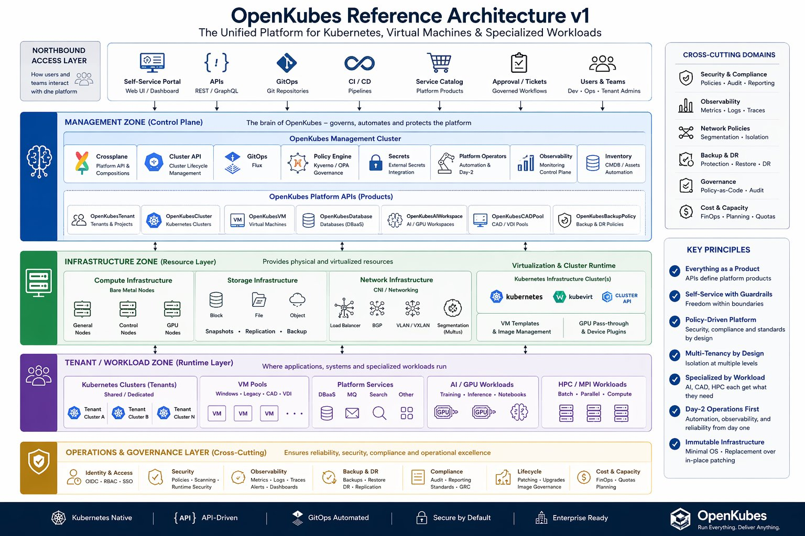

# OpenKubes Reference Architecture

> 🇩🇪 [Deutsche Version](reference-architecture-v1-de.md) | 🇬🇧 [English Version](reference-architecture-v1-en.md)

---

## Overview

OpenKubes is built around a clear separation of concerns across four zones:

| Zone | Purpose |
|------|---------|
| **Management Zone** | Controls, provisions, secures and governs the platform |
| **Infrastructure Zone** | Provides physical and virtualized resources |
| **Tenant / Workload Zone** | Hosts clusters, VMs, AI, HPC and platform services |
| **Operations & Governance** | Ensures reliability, security and compliance (cross-cutting) |

---

## Core Technology Decisions

| Concern | Technology |
|---------|-----------|
| Control Plane | Kubernetes (RKE2 / Talos) |
| VM Layer | KubeVirt |
| Cluster Lifecycle | Cluster API (CAPI + CAPK) |
| Platform API | Crossplane |
| GitOps | Flux |
| CNI | Cilium (recommended) / Calico |
| Load Balancer | MetalLB |
| Secrets | External Secrets |
| Policy | Kyverno / OPA |
| Identity | OIDC / Keycloak |

---

## Platform APIs (Products)

| API | Description |
|-----|-------------|
| `OpenKubesCluster` | Self-service Kubernetes clusters |
| `OpenKubesVM` | VM-as-a-Service |
| `OpenKubesDatabase` | DBaaS |
| `OpenKubesTenant` | Tenant / project isolation |
| `OpenKubesAIWorkspace` | AI / GPU workspaces |
| `OpenKubesCADPool` | CAD / VDI pools |
| `OpenKubesBackupPolicy` | Backup & DR policies |

---

## Deep Dives

- [Reference Architecture v1 (English)](reference-architecture-v1-en.md)
- [Referenzarchitektur v1 (Deutsch)](reference-architecture-v1-de.md)
