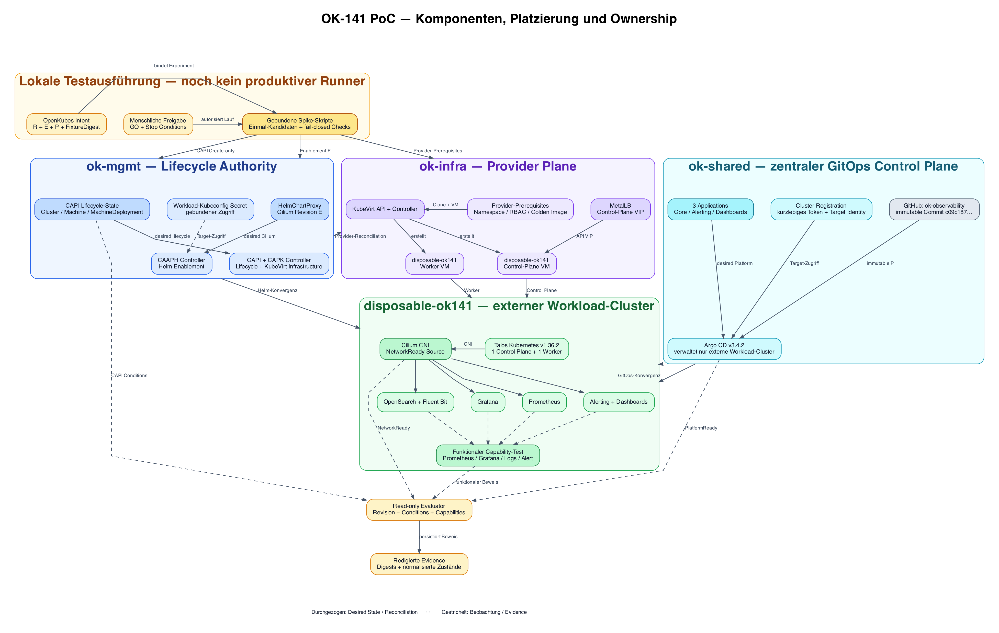

# OK-141 PoC component diagram



The diagram records the component placement and ownership boundaries demonstrated by the OK-141 happy run:

- `ok-mgmt` owns CAPI/CAPK lifecycle state and CAAPH-based enablement.
- `ok-infra` provides KubeVirt compute and the MetalLB control-plane endpoint.
- Argo CD on `ok-shared` reconciles only external workload clusters.
- `disposable-ok141` is the disposable Talos workload cluster used by the PoC.
- The current execution mechanism consists of bounded, fail-closed spike scripts. It is not yet a production OpenKubes runner.
- A read-only evaluator correlates lifecycle, network, platform, and functional evidence without becoming a second lifecycle writer.

The PNG is generated from the adjacent Graphviz source:

```bash
dot -Tpng -Gdpi=150 \
  ok141-poc-component-diagram.dot \
  -o ok141-poc-component-diagram.png
```
