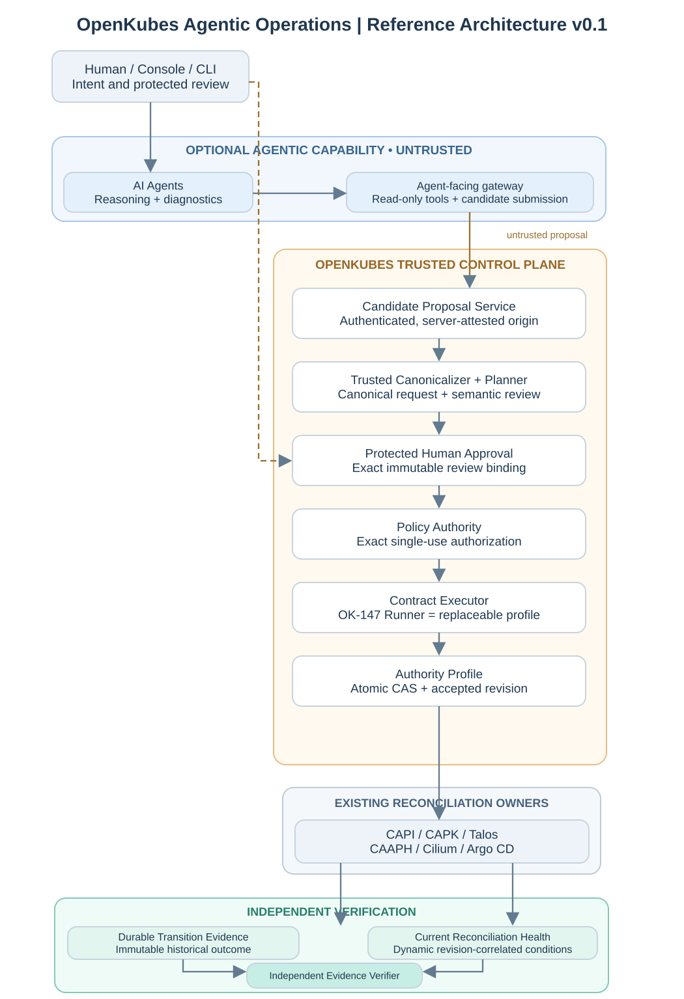

# AI Thinks. OpenKubes Executes. Evidence Proves.

*Building a Reference Architecture for Trustworthy Agentic Kubernetes Operations*

*OpenKubes Architecture Team · October 2026 · Architecture proposal v0.1*

> **Status: Proposed — No Implementation Commitment.** This article presents an architectural intent for community discussion, not a release announcement or a claim of production-ready agent-originated mutations.

## What happens when AI agents start operating Kubernetes?

AI agents are becoming increasingly capable of understanding complex infrastructure environments. They can inspect Kubernetes resources, analyze logs, correlate events, interpret documentation, and propose solutions to operational problems.

But an important architectural question remains:

**Should an AI agent that can understand a problem also have the authority to change the infrastructure?**

Our answer is **no**.

At OpenKubes, we believe intelligence and authority should remain separate. An AI agent may help determine *what might need to be done*. The platform remains responsible for validating, authorizing, executing, and verifying an operation.

This is the foundation of our proposed **OpenKubes Agentic Operations Reference Architecture v0.1**.

**AI thinks. OpenKubes executes. Evidence proves.**

## Why Agentic Operations?

Kubernetes already provides powerful declarative APIs, controllers, and reconciliation mechanisms. Platform engineering projects build on these capabilities to automate provisioning, cluster lifecycle management, networking, GitOps, and application delivery.

OpenKubes follows a contract-driven architecture in which platform capabilities are defined independently of their implementations.

So why introduce AI agents at all?

Because there is an important difference between **executing a known operation** and **understanding which operation might be appropriate**.

A bounded, deterministic execution engine can act on a validated plan. It does not necessarily understand why a cluster is failing, which previous incidents might be relevant, or which alternative configuration an engineer should consider.

That is where AI-assisted reasoning *could* add value.

We envision six practical benefits:

- **Intelligent troubleshooting.** Correlate Kubernetes Conditions, events, logs, operational evidence, and runbooks to generate prioritized hypotheses, including counter-evidence.
- **Natural-language operations.** Describe operational intent conversationally while the agent prepares a structured, **non-authoritative** candidate.
- **Context-aware planning.** Compare configurations, capacity, and declared constraints before proposing an appropriate change.
- **Assisted recovery.** Investigate failures and prepare alternative plans for human review—never silently retry a mutation.
- **Operational knowledge access.** Make ADRs, architecture documentation, and runbooks easier to discover and understand.
- **Evidence-based explanations.** Translate independently verifiable platform results into accessible operational reports.

These are **expected benefits**, not measured OpenKubes outcomes. Their value must eventually be demonstrated through operator-time measurements, diagnostic accuracy, and operational workflows—not the number of agents deployed.

## Contracts over components

One of our foundational principles is:

**OpenKubes owns the contracts, not the components.**

A platform capability should not depend on a particular implementation technology. A cluster lifecycle implementation may change while its contract remains stable.

The same applies to AI agents.

OpenKubes Agentic Operations should not depend on a specific model, agent framework, or conversational interface. OpenClaw, kagent, or future technologies may act as implementation profiles if they respect the relevant contracts.

Likewise, the Model Context Protocol (MCP) may be a useful **adapter** for agent-facing interactions, but it must not become the authoritative definition of platform behavior.

**Agents remain replaceable. Platform contracts remain authoritative.**

## The proposed reference architecture

We envision Agentic Operations as an **optional intelligence layer** above the existing OpenKubes control plane.

The architecture separates four responsibility domains.

### 1. Agentic intelligence — untrusted

AI agents interpret natural-language requests, consult authorized read-only diagnostics, reason about conditions, and prepare candidates.

Their output is treated as **untrusted input**. Agents cannot directly mutate authoritative desired state, approve changes, issue policy grants, or declare lifecycle success.

### 2. Trusted platform control plane

A proposed Candidate Proposal interface accepts the agent's non-authoritative request. Trusted mechanisms establish authenticated origin and provenance, perform deterministic canonicalization, and derive an exact semantic transition.

An authenticated human reviews the **actual semantic change**, including effective defaults. An independent Policy Authority determines whether that transition is permitted and, when appropriate, binds a short-lived, single-use authorization to it.

The existing replaceable Contract Executor verifies authorization and performs bounded actions. A selected Authority Profile must atomically accept the exact desired-state transition using compare-and-swap semantics.

None of these logical roles necessarily requires its own microservice.

### 3. Existing reconciliation owners

The agent does not become a Kubernetes reconciler.

Cluster API and its providers, networking enablement, Kubernetes controllers, and GitOps retain responsibility for converging their respective domains. The Contract Executor may submit and observe; it does not become a second owner of the infrastructure lifecycle.

### 4. Independent evidence

A language-model response does not establish success.

A valid outcome must be grounded in authoritative acceptance, durable execution records, and revision- and generation-correlated observations from the responsible controllers. An independent verifier should be able to establish the result **without trusting the agent's interpretation**.

The diagram above shows **logical trust and ownership boundaries**, not a set of deployed services.

## Agents propose. Humans approve. Policies authorize.

Consider a developer asking:

> Create a development Kubernetes cluster with two worker nodes, Cilium networking, and GitOps enabled.

In a simple tool-based integration, an AI agent might translate this request directly into infrastructure commands.

Our proposal deliberately places stronger boundaries between understanding and changing infrastructure:

1. The agent prepares an **untrusted candidate**, not authoritative desired state.
2. A trusted service records authenticated, server-attested provenance.
3. A deterministic canonicalizer derives the exact requested transition from the currently authoritative revision.
4. A protected review process shows the **human-visible semantic diff** and effective defaults; the human approves precisely that review artifact.
5. The Policy Authority evaluates the exact transition and issues a bounded authorization or denial.
6. The Contract Executor verifies and durably claims authorization before any possible authority mutation.
7. The Authority Profile atomically accepts the requested revision—or rejects a stale/conflicting write.
8. Existing controllers reconcile the accepted state. Independent evidence verifies the historical outcome.

Authorization is **not** acceptance. Acceptance is **not** convergence. Successful submission is **not** proof of readiness.

If the operation is denied, no authoritative acceptance or executor mutation should occur. An agent may explain the policy result and prepare a different candidate, but it may not override it.

## The Runner is an implementation detail

OpenKubes already has a bounded Contract Executor implementation developed through the OK-147 work. Its building blocks include deterministic canonicalization, signed stage authorization, durable claims, bounded submission, observation, and evidence receipts.

These are valuable foundations, but they do not mean we have already implemented the full agent-originated control path.

The Runner is neither the platform contract nor an autonomous AI component. Its job is to execute and observe an already authorized operation within defined limits.

The proposed integration still requires a trustworthy chain connecting candidate provenance, human semantic approval, authorization, atomic desired-state acceptance, and independent verification.

We should not conflate a signed stage grant with human approval, an execution claim with authority acceptance, or a successful submission with reconciled cluster health.

## What if the AI agent is wrong?

Models can misunderstand instructions, invent configuration, rely on incomplete information, or be influenced by malicious input. A trustworthy platform should not depend on model infallibility.

Our proposed boundaries are therefore designed to **contain** model error:

- Candidates never become authoritative state merely because an agent emitted them.
- Agents cannot directly reach protected approval, policy, Executor, or Authority mutation APIs.
- The exact canonical transition and its versioned human-readable review are bound to approval.
- Authorization is constrained by identity, audience, time, transition, and single use.
- Ambiguous input, stale writes, replay attempts, and uncertain acceptance results fail closed.
- Candidate stores remain outside active reconciliation watch paths.
- An agent cannot certify its own success.

This is how intelligence can assist operations **without receiving infrastructure authority**.

## Evidence proves—even if the agent says “success”

Imagine an agent reports:

> The Kubernetes cluster was created successfully.

By itself, that statement proves nothing about the cluster's state. The agent may be repeating a successful API response or a completed submission step.

OpenKubes distinguishes the authority decision, execution activity, controller observations, **immutable historical transition outcome**, and **dynamic current health**.

Suppose a transition from revision R17 to R18 was successfully realized. The cluster subsequently drifts or becomes degraded.

The historical transition remains **SUCCEEDED**. Later drift changes **Current Health**, producing new observations without rewriting the evidence of the earlier result.

This separation matters particularly when agents continuously interpret changing systems. An agent can explain both views; it must not be the authority for either.

## A practical example: Cilium is not Ready

Imagine a newly created Kubernetes cluster whose control plane is available while required networking conditions remain unsatisfied.

Without agent assistance, an engineer inspects Cluster API Conditions, Cilium resources, events, network profiles, CIDRs, and runbooks.

With the proposed capability, an agent could correlate authorized diagnostic observations and suggest investigating a mismatch between the expected and observed Cilium configuration or Pod CIDRs.

That is **a hypothetical diagnostic hypothesis**, not a verified root cause for an actual incident. The agent must cite the relevant evidence and acknowledge alternatives. If it proposes a configuration change, that change still requires canonical review, human approval, policy authorization, and authority acceptance.

The value is not unrestricted remediation.

**The value is reducing the work required to move from symptoms to an informed, reviewable decision.**

## Optional intelligence—not another mandatory control plane

OpenKubes must remain functional if an AI agent, model server, or conversational frontend becomes unavailable.

Core lifecycle operations, policy enforcement, reconciliation, and evidence verification cannot depend on an agent being online.

Nor does this reference architecture require a new AI Runner, a dedicated Agent Gateway microservice, a generic tool executor, or a separate lifecycle controller.

The architecture defines **responsibilities and trust boundaries**, not a shopping list of components.

## What exists today—and what remains proposed?

Our October 2026 read-only feasibility assessment identified meaningful foundations:

- An ADR-driven, contract-based platform architecture.
- Read-only agent diagnostics and a documented AI proof of concept.
- Bounded OK-147 Runner mechanisms for canonicalization, signed authorization, durable claims, and submissions.
- Observation, receipts, and selected DEV-profile evidence mechanisms.

It also found important missing end-to-end elements:

- A Candidate Proposal interface with server-attested provenance.
- Protected human approval of an exact canonical semantic transition.
- Policy authorization cryptographically tied to that approval.
- ADR-034-style atomic desired-state acceptance.
- Independent verification of the *complete* agent-originated chain.

The feasibility review described the approach as **feasible with conditions**, not as implemented. No complete PASS was evidenced across ADR-035's fourteen agentic acceptance criteria at that review point. Some foundational source tests and bounded DEV evidence exist, but this is **not** an independently re-run full-suite or production-readiness certification.

**OpenKubes Agentic Operations v0.1 is a proposed reference architecture with no implementation commitment.**

## How should we measure success?

Success should be measured by operational outcomes, not model demos:

- **Time to diagnose:** Do operators identify credible root-cause hypotheses sooner?
- **Recovery planning effort:** Can teams prepare accurate, reviewable recovery alternatives faster?
- **Human provisioning effort:** Does candidate authoring reduce time spent on configuration without increasing approval risk?
- **Operator toil:** Are repetitive investigation steps eliminated?
- **Knowledge accessibility:** Are ADR and runbook questions answered faster and more accurately?

Any evaluation must include model latency and cost, additional review work, integration maintenance, misleading diagnoses, and security risks. These benefits are hypotheses until measured against comparable non-agent workflows.

## The road ahead: an invitation to challenge the design

This initiative is currently about **architectural intent and community review**. We are not announcing an autonomous AI controller, a new release, or an implementation date.

We welcome technical challenges to our candidate isolation, human-review integrity, policy boundaries, atomic acceptance semantics, reconciliation ownership, and independent evidence model.

We also plan to discuss the ideas around AI Tinkerers Düsseldorf on **November 25, 2026**. The event is an opportunity to discuss the architecture, **not** a delivery commitment for the complete capability.

Read the design sources:

- [OpenKubes Architecture Intent (Confluence)](https://kubernauts.atlassian.net/wiki/spaces/OpenKubes/pages/3167420417)
- [OpenKubes Reference Architecture v0.1 (Confluence)](https://kubernauts.atlassian.net/wiki/spaces/OpenKubes/pages/3167584257)
- [ADR-Platform-001 — Contracts, not Components](https://github.com/openkubes/openkubes/blob/main/architecture/decisions/ADR-Platform-001-contracts-not-components.md)
- [ADR-Platform-004 — Runner as Implementation Detail](https://github.com/openkubes/openkubes/blob/main/architecture/decisions/ADR-Platform-004-runner-is-implementation-detail.md)
- [ADR-Platform-021 — Read-Only Diagnostics (Draft)](https://github.com/openkubes/openkubes/blob/main/architecture/decisions/ADR-Platform-021-read-only-platform-diagnostics-contract.md)
- [ADR-Platform-034 — Authorized Desired-State Transitions (Proposed)](https://github.com/openkubes/openkubes/blob/main/architecture/decisions/ADR-Platform-034-ok-up.md)
- [ADR-Platform-035 — Hybrid Intent and Control-Plane Execution (Proposed)](https://github.com/openkubes/openkubes/blob/main/architecture/decisions/ADR-Platform-035-hybrid-intent-and-control-plane-execution.md)
- [OpenKubes on GitHub](https://github.com/openkubes)

---

**AI thinks. OpenKubes executes. Evidence proves.**

*The objective is not to make AI agents powerful enough to control Kubernetes. It is to make AI-assisted operations trustworthy enough for platform engineering.*
