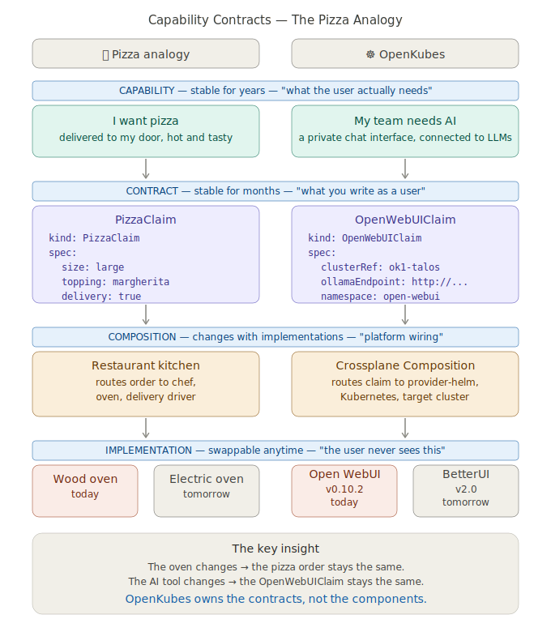

# OpenKubes Contracts Explained — The Pizza Analogy

*A simple explanation for anyone new to platform engineering.*

---

## The big idea in one sentence

> **OpenKubes says WHAT you get — not HOW it is built.**

---

## Platform Contracts visualized



---

## Start with pizza

Imagine you order a pizza:

```yaml
apiVersion: pizza.restaurant/v1
kind: PizzaClaim
metadata:
  name: my-pizza
spec:
  size: large
  topping: margherita
  delivery: true
```

You don't need to know:
- Which oven the restaurant uses (wood-fired or electric)
- Where the flour comes from
- Who drives the delivery

You just describe **what you want**. The restaurant handles the rest.

That YAML is a **contract** — your order stays the same,
regardless of how the restaurant is organized behind the scenes.

---

## Now OpenKubes — same idea

```yaml
apiVersion: platform.openkubes.ai/v1alpha1
kind: OpenWebUIClaim
metadata:
  name: my-team
  namespace: openkubes-system
spec:
  clusterRef: ok1-talos        # which cluster should get it
  ollamaEndpoint: http://...   # where the AI model runs
  namespace: open-webui
```

You don't need to know:
- Which Helm chart deploys Open WebUI
- How Crossplane wires everything together
- Whether the cluster runs Talos or Ubuntu underneath

You just describe **what you want**. The platform handles the rest.

---

## The old way vs. the OpenKubes way

**Before** — you had to know everything and do it yourself:

```bash
helm repo add open-webui https://helm.openwebui.com/
helm install open-webui open-webui/open-webui \
  --namespace open-webui \
  --set ollama.enabled=false \
  --set externalOllama.baseUrl=http://... \
  --create-namespace
kubectl label namespace open-webui \
  pod-security.kubernetes.io/enforce=privileged
kubectl patch storageclass local-path \
  -p '{"metadata": {"annotations": {...}}}'
# ... and 10 more steps
```

**Today with OpenKubes** — you describe what you want:

```bash
kubectl apply -f openwebuiclaim.yaml
# done. Open WebUI is running in ~90 seconds.
```

---

## What is a "contract" exactly?

A contract is a **stable promise** between you (the consumer)
and the platform (the provider).

```
You say:    "I want an AI chat interface for my team"
            → kind: OpenWebUIClaim

Platform:   "Got it — here it is"
            → Crossplane + Helm + Kubernetes magic
```

The contract answers three questions:
1. **What** does the consumer need? (`spec.clusterRef`, `spec.ollamaEndpoint`)
2. **What** does the platform promise to deliver? (Open WebUI, running, connected to Ollama)
3. **What** does NOT need to be specified? (Helm version, StorageClass, pod security labels)

---

## "But what if Open WebUI is replaced tomorrow?"

Great question. Here is the honest answer:

If Open WebUI is replaced by something better, the **Claim name changes too**:

```yaml
# Today
kind: OpenWebUIClaim

# Tomorrow (if replaced)
kind: AIChatInterfaceClaim
```

But the **capability** stays the same:

> *"Every team gets their own private AI workspace."*

The capability is stable. The tool that delivers it is swappable.

This is what **"OpenKubes owns the contracts, not the components"** really means:

| What OpenKubes owns | What OpenKubes does NOT own |
|---|---|
| The capability: "AI chat for every team" | Open WebUI (the specific tool) |
| The contract fields: clusterRef, ollamaEndpoint | The Helm chart version |
| The promise: deployed in ~90 seconds | Crossplane internals |

---

## The contract hierarchy

```
Capability (stable — years)
    "Every team gets an AI workspace"
        ↓
Contract (stable — months)
    kind: OpenWebUIClaim
    spec: clusterRef + ollamaEndpoint
        ↓
Composition (changes with implementations)
    Helm Release via provider-helm
        ↓
Implementation (swappable anytime)
    Open WebUI v0.10.2, Helm chart v15.2.0
```

The further up you are, the more stable things are.
You write at the **Contract** level — never at the **Implementation** level.

---

## The three OpenKubes contracts today

| Contract | Kind | What it promises |
|---|---|---|
| Cluster Lifecycle | `KubeVirtClusterClaim` | A running Kubernetes cluster |
| AI Chat Interface | `OpenWebUIClaim` | Open WebUI connected to Ollama |
| OS Profile | `profile: kubevirt` in ok-linux | A verified Talos image with the right schematic ID |

Each contract is owned by the platform. Implementations are swappable.

---

## One more analogy — electrical outlets

An electrical outlet is a contract:

- You plug in **any** device (lamp, phone charger, toaster)
- You don't care how the power station generates electricity
- The outlet standard stays stable for decades

OpenKubes platform contracts work the same way:

- Teams plug in **any** workload via a Claim
- Teams don't care which Helm chart or Crossplane version is used
- The Claim API stays stable even when implementations change

---

> *"Problems change very little. Only our language for them gets better."*
>
> — GPT, during the OpenKubes architecture review, July 2026

---

## See also

- [ADR-Platform-001: OpenKubes owns the contracts, not the components](../architecture/decisions/ADR-Platform-001-contracts-not-components.md)
- [platform/ai/open-webui/crossplane/](../platform/ai/open-webui/crossplane/)
- [openkubes/ok-cluster](https://github.com/openkubes/ok-cluster)
