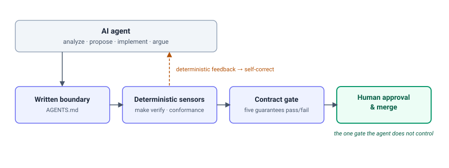

# The Contract Is the Guardrail

*By Arash Kaffamanesh · Clouds Sky GmbH & Kubernauts GmbH*

---

In a recent pilot on our OpenKubes observability stack, an AI agent fixed a crashing deployment, discovered two bugs in the very test that was grading its work, and declined a change because it crossed a repository ownership boundary. None of those outcomes required trusting the model. They required a contract — and a rule:

> AI may analyze, propose, implement, and argue. Only humans approve and merge.

That rule only works if the environment around it has structure. Three layers did the work. First, a written operating boundary: what the repository is for, which decisions govern it, what is off-limits, and when to escalate. Second, deterministic executable checks that pass or fail on their own, with no model in the loop. Third, a human-controlled acceptance gate: no proposal becomes accepted platform behavior until a person approves and merges it. In OpenKubes these are concrete artifacts: an `AGENTS.md` guide, a small set of Make targets (`verify`, `conformance`, `evidence`), and a contract test that encodes the observability capability's promises.

**What the pilot demonstrated.** A Prometheus pod kept crashing with a permission-denied panic. The deterministic signal was concrete: a filesystem-group setting wasn't being applied to the mounted data subpath Prometheus used. The fix — an init container that prepares that same subpath — had to live in the committed chart, not in a one-off patch on a single cluster, or the next clean install would break again. The same feedback loop then exposed incorrect assumptions in the contract test itself: how it selected the workload to watch, and what it expected from OpenSearch's security setup. The sensors challenged not just the implementation but the test grading it. With both corrected, the checks passed from a clean install on two separate clusters.

**Where the boundary held.** The agent declined to add a deployment target to the observability repository, because installing clusters is another repository's job — an ownership line it recognized rather than crossed. Decisions with real consequences — the credentials model, a gate timeout, anything architectural — were escalated to a human rather than settled unilaterally. The agent could still propose the wrong thing. It could not make that proposal accepted platform behavior on its own.

The portable lesson isn't the filenames. Write the boundary down. Turn its observable promises into deterministic checks. Keep acceptance authority human. In this pilot, that combination made AI-assisted engineering safer, faster to correct, and easier to review. Fittingly, the pilot's own ADOPT recommendation followed the same rule as the engineering work: the agent drafted and argued the case; a human ratified it.

**Where the code lives.** The operating boundary, deterministic checks, and contract tests described here are concrete artifacts in the public [`openkubes/openkubes`](https://github.com/openkubes/openkubes) repository — see the [architecture decisions](https://github.com/openkubes/openkubes/tree/main/architecture/decisions) and the [platform engineering method](https://github.com/openkubes/openkubes/blob/main/docs/platform-engineering-method.md).

*Author's note: The engineering pilot used Claude/Cowork. This article was refined through a human-led three-way review involving Claude and GPT; the final editorial decisions were made by the author.*
