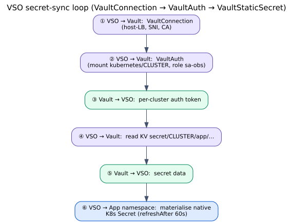
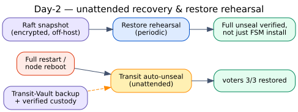

# The Secret Contract, Made Real — Central Vault + VSO as a Datacenter Profile

*By Arash Kaffamanesh · Clouds Sky GmbH & Kubernauts GmbH*

---

Every platform eventually meets the same unglamorous question: **where do secrets live, and how does a workload three clusters away get exactly the one it needs — and nothing more?** The wrong answers are familiar. Copy a Kubernetes Secret by hand and it drifts. Bake credentials into a chart and they leak into Git. Give every cluster a shared admin token and you've traded a secrets problem for a blast-radius problem.

OpenKubes takes the position it takes everywhere: **own the contract, not the tool.** The Secret Contract says *what* a capability is promised — a named secret, materialised as a native Kubernetes Secret, scoped to one workload identity, reconciled from a single source of truth. It deliberately does not say *which* backend. For the datacenter envelope, we chose a concrete implementation profile of that contract: a central **HashiCorp Vault** consumed on each cluster through the **Vault Secrets Operator (VSO)**. This post is the story of that profile — how it fits together, how it installs, how it's operated, and what broke along the way.

**One Vault, reached over end-to-end TLS.** The production Vault runs as a highly-available Raft cluster on a shared services cluster, fronted by a leader-only service. Consumers never talk to a pod directly: they dial a stable host load balancer, and Traefik passes the TCP stream straight through to the active node — TLS is never terminated in the path. The result is a single, auditable secret backend that any registered cluster can reach without bespoke per-cluster networking.

**Crossplane makes the trust declarative.** The interesting part isn't installing Vault — it's onboarding a cluster to it without hand-cranking auth mounts and policies. In OpenKubes that's a Crossplane concern. A `VaultInstance` composite resource pins the central Vault as a bounded **singleton** — an admission policy on the management cluster rejects a second production instance outright. A per-cluster `VaultConfig` resource then reconciles, inside Vault, everything a new consumer needs: its own Kubernetes auth mount, a role bound to a specific workload ServiceAccount, and a least-privilege read policy scoped to just that cluster's secret path. Registering a cluster is what onboards it to Vault — the same registration contract the rest of the platform already uses.

**Day-1 is a sequence, not a pile of YAML.** Standing the platform up follows an ordered path: deploy Vault HA, run the seal ceremony with verified custody, move the seal to unattended auto-unseal, and switch on the singleton admission guard. Onboarding a consumer is then a repeatable five-step tail: register the cluster, install VSO, seed the secret into Vault (a custodian action — the admin identity is never shared with cluster owners), and — the one ordering rule that actually bites — apply the `VaultStaticSecret` **before** the application's Helm release, because software like OpenSearch bakes its admin password at first boot. Verify last: the operator reports the secret synced and healthy, and the capability's contract test stays green with no chart change.

**How a secret actually flows.** Once wired, the loop is boring in the best way. The operator opens a connection to Vault over the host load balancer with the right SNI and CA, authenticates with its per-cluster mount and ServiceAccount-bound role, reads the one KV path its policy allows, and writes the result into the namespace as a native Kubernetes Secret — refreshing on an interval. Nothing in the application changes; it keeps reading a Secret by the same name and keys it always used. Adopting Vault is a swap underneath the contract, not a rewrite above it.

**Day-2 is where a design earns its keep.** Auto-unseal means a full restart recovers with no human in the loop — the cluster comes back and re-forms quorum on its own. Backups are encrypted, off-host Raft snapshots taken before every change, paired with a restore rehearsal that proves recovery *through a full unseal* — not merely that a snapshot file exists. Rotation is a first-class path: change the value in Vault, the operator refreshes, the native Secret updates, and targeted workloads roll to pick it up.

**The lesson we paid for.** Early on, we lost the passphrase protecting a seal-custody artifact — and discovered, the hard way, that a backup you have never decrypted is not a backup. It hardened two rules that now sit at the centre of the operating model: **decrypt round-trip every custody artifact** the moment you create it and again at every rehearsal; and **move off attended unseal to an independently-bootstrapped auto-unseal origin**, so that recovery never hinges on a single memorised secret. Neither rule is exotic. Both are the kind of thing you only truly adopt after the alternative has scared you once.

**The through-line is the contract.** The singleton guard, the per-cluster least-privilege policies, the "materialise before the app starts" ordering, the restore-through-unseal rehearsal — these aren't Vault trivia. They're the observable promises of the Secret Contract, turned into deterministic checks a machine can grade and a human can trust. The backend is replaceable; edge and offline clusters run a different profile of the very same contract. What stays constant is the shape of the promise. In OpenKubes, that's the whole point: **the contract is the guardrail** — and secrets are just one more capability that has to live inside it.

*Author's note: The engineering behind this profile was carried out with Claude/Cowork and refined through a human-led three-way review involving Claude and GPT; the final editorial and architectural decisions were made by the author. Diagrams are sanitised for public use; internal endpoints and operational specifics live in the team's runbooks.*
