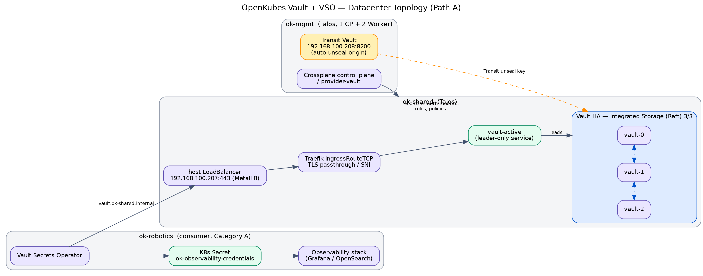
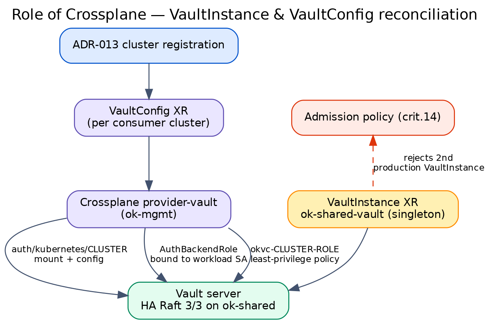
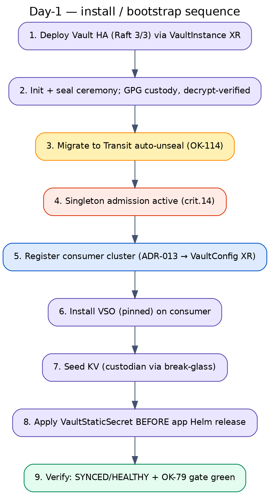
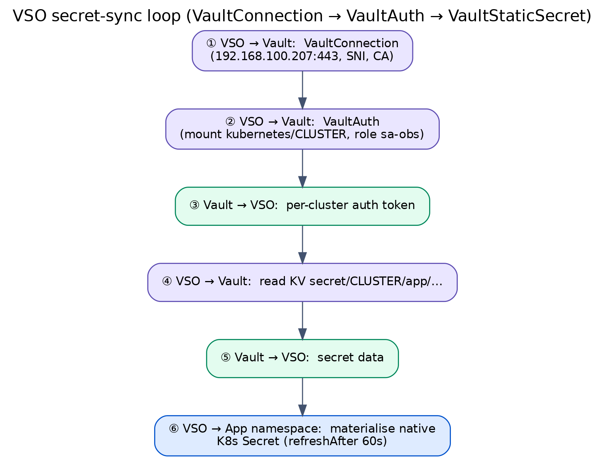
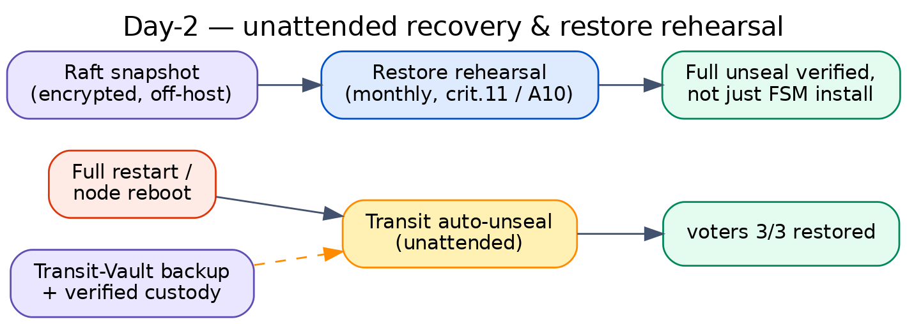

# Vault + VSO — Day-1 / Day-2 diagrams

Architecture diagrams for the datacenter-envelope Secret profile (ADR-Platform-025).
Mirrors the Confluence page *Vault + VSO — Day-1 / Day-2 Operations Guide*
([3125116930](https://kubernauts.atlassian.net/wiki/spaces/OpenKubes/pages/3125116930)).

## Layout

- `src/*.mmd` — Mermaid sources (what the Confluence page renders natively).
- `src/*.dot` — Graphviz sources (browser-free render path used to produce the exports below).
- `svg/*.svg` — scalable exports (use these on openkubes.org).
- `png/*.png` — 200 dpi raster exports.

## Diagrams

### 1. Architecture topology (ok-mgmt / ok-shared / consumer + Path A reachability)



_Vector: [svg/01-architecture-topology.svg](svg/01-architecture-topology.svg)_

### 2. Role of Crossplane (VaultInstance singleton crit.14 + VaultConfig XR + provider-vault)



_Vector: [svg/02-crossplane-reconciliation.svg](svg/02-crossplane-reconciliation.svg)_

### 3. Day-1 install / bootstrap + consumer onboarding (steps 1–9)



_Vector: [svg/03-day1-bootstrap-sequence.svg](svg/03-day1-bootstrap-sequence.svg)_

### 4. VSO secret-sync loop (VaultConnection → VaultAuth → VaultStaticSecret)



_Vector: [svg/04-vso-sync-sequence.svg](svg/04-vso-sync-sequence.svg)_

### 5. Day-2 unattended recovery + restore rehearsal



_Vector: [svg/05-day2-recovery.svg](svg/05-day2-recovery.svg)_

## Re-render

Graphviz (no browser required):

```bash
for f in src/*.dot; do
  b=$(basename "${f%.dot}")
  dot -Tsvg "$f" -o "svg/$b.svg"
  dot -Tpng -Gdpi=200 "$f" -o "png/$b.png"
done
```

Mermaid (needs a headless browser via `@mermaid-js/mermaid-cli`):

```bash
for f in src/*.mmd; do mmdc -i "$f" -o "svg/$(basename "${f%.mmd}").svg"; done
```
